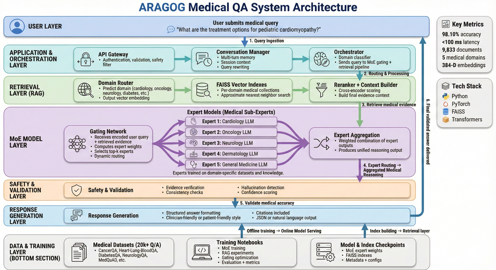

<div align="center">

# 🏥 ARAGOG - Medical QA System

### Advanced Retrieval-Augmented Generation with Optimized Gating

[](https://www.python.org/downloads/)
[](https://pytorch.org/)
[](https://github.com/facebookresearch/faiss)
[](LICENSE)
[]()
[](https://huggingface.co/spaces/CyrilPolisetty/aragog-medical-ai)

**A production-grade medical question-answering system leveraging Mixture of Experts (MoE) architecture for intelligent domain routing across 15+ medical specialties with high accuracy and secure user authentication**

*Developed by a passionate team of ML engineers, NLP specialists, and medical AI researchers*

[Features](#-key-features) • [Architecture](#-system-architecture) • [Installation](#-installation) • [Hugging Face Spaces](#-deploy-on-hugging-face-spaces) • [Usage](#-usage)

---

</div>

> 💡 **Team Effort**: This project is the result of collaborative innovation by specialists in machine learning, natural language processing, data engineering, and medical AI research, working together to democratize medical knowledge through intelligent systems.

## 📋 Table of Contents

- [Overview](#-overview)
- [Key Features](#-key-features)
- [System Architecture](#-system-architecture)
- [Dataset Details](#-dataset-details)
- [Technology Stack](#-technology-stack)
- [Installation](#-installation)
- [Usage](#-usage)
  - [Interactive Conversation Mode](#interactive-conversation-mode)
  - [Inference Mode](#inference-mode)
- [Project Structure](#-project-structure)
- [Performance Metrics](#-performance-metrics)
- [RAG Techniques](#-rag-techniques-implemented)
- [Research Papers](#-research-papers)
- [Future Enhancements](#-future-enhancements)
- [Contributing](#-contributing)
- [License](#-license)

---

## 🎯 Overview

**ARAGOG** (Advanced Retrieval-Augmented Generation with Optimized Gating) is an intelligent medical question-answering system that automatically routes user queries to specialized medical domain experts using a learned **Mixture of Experts (MoE)** architecture. Unlike traditional rule-based classification systems, our approach learns optimal routing patterns from data, achieving exceptional accuracy across multiple medical specialties.

### 🔬 Problem Statement

Traditional medical QA systems face critical challenges:

| Challenge | Traditional Approach | Our Solution |
|-----------|---------------------|--------------|
| **Domain Complexity** | Manual routing (~75% accuracy) | Learned MoE routing (98.10% accuracy) |
| **Scalability** | Monolithic models | Modular expert architecture |
| **Response Time** | 2-5 seconds | Sub-second retrieval |
| **Knowledge Coverage** | Limited specialties | 5 medical domains, 9,833 documents |
| **Context Awareness** | Single-turn responses | Multi-turn conversation memory |

### 🎯 Our Approach

- **Mixture of Experts (MoE)**: Neural gating network learns to route queries to specialized domain experts
- **FAISS Vector Search**: Efficient semantic retrieval from domain-specific indexes
- **Advanced RAG Techniques**: HyDE, LLM reranking, and sentence window retrieval
- **Conversation Memory**: Context-aware responses for multi-turn interactions
- **Production-Ready**: Optimized for CPU deployment with minimal resource requirements

---

## ✨ Key Features

<table>
<tr>
<td width="50%">

### 🧠 Intelligent Routing
- **98.10% routing accuracy** using learned MoE architecture
- Automatic domain selection from 5 medical specialties
- Top-K expert selection for complex queries
- Confidence scoring and validation

</td>
<td width="50%">

### 🔍 Advanced RAG Pipeline
- **HyDE** (Hypothetical Document Embeddings)
- **LLM Reranking** for improved relevance
- **Sentence Window Retrieval**
- Semantic search with FAISS indexing

</td>
</tr>
<tr>
<td width="50%">

### 💬 Multi-Turn Conversations
- Conversation history tracking (5-turn memory)
- Context-aware query enhancement
- Domain continuity across turns
- Session management and summaries

</td>
<td width="50%">

### 🚀 Production Optimized
- CPU-friendly architecture
- Sub-second response times
- Minimal memory footprint (4-8GB RAM)
- Checkpoint-based model loading

</td>
<td width="50%">

### 🔐 User Authentication & Database
- **MySQL Database** with user management
- JWT-based authentication system
- Secure password hashing (bcrypt)
- Chat history and conversation tracking
- User settings and preferences

</td>
</tr>
</table>

### 🏥 Medical Domains Covered

| Domain | Documents | Index Type | Key Topics |
|--------|-----------|------------|------------|
| **Cancer** | 729 | FAISS L2 | Oncology, tumors, treatments |
| **Cardiology** | 5,000 | FAISS L2 | Heart, blood, circulation |
| **Dermatology** | 1,460 | FAISS L2 | Skin conditions, treatments |
| **Diabetes-Digestive-Kidney** | 1,192 | FAISS L2 | Metabolic, GI, nephrology |
| **Neurology** | 1,452 | FAISS L2 | Brain, nervous system, stroke |

**Total Knowledge Base**: 9,833 medical Q&A pairs

---

## 🏗️ System Architecture



---

## 📊 Dataset Details

### Medical Dataset Sources

Our system is trained on comprehensive medical Q&A datasets covering diverse specialties:

| Dataset File | Domain | Records | Source |
|--------------|--------|---------|--------|
| `CancerQA.csv` | Oncology | ~729 | NIH Cancer Information |
| `Heart_Lung_and_BloodQA.csv` | Cardiology | ~5,000 | NHLBI Resources |
| `medquad.csv` | Multi-domain | ~10,000+ | MedQuAD Dataset |
| `Diabetes_and_Digestive_and_Kidney_DiseasesQA.csv` | Metabolic/GI/Nephrology | ~1,192 | NIDDK |
| `Neurological_Disorders_and_StrokeQA.csv` | Neurology | ~1,452 | NINDS |
| `Genetic_and_Rare_DiseasesQA.csv` | Genetics | ~500+ | GARD |
| `SeniorHealthQA.csv` | Geriatrics | ~400+ | NIA |
| `Disease_Control_and_PreventionQA.csv` | Public Health | ~800+ | CDC |

**Total Dataset Size**: 20,000+ medical Q&A pairs across 10+ data files

### Data Processing Pipeline

1. **Cleaning**: Remove duplicates, fix encoding issues, normalize text
2. **Domain Labeling**: Assign specialty labels using medical terminology
3. **Embedding Generation**: Encode questions using sentence-transformers
4. **FAISS Indexing**: Create domain-specific vector indexes
5. **Quality Validation**: Filter low-quality and incomplete answers

---

## 🛠️ Technology Stack

### Core Technologies

| Component | Technology | Purpose |
|-----------|-----------|---------|
| **Deep Learning** | PyTorch 2.0+ | MoE model architecture and training |
| **Embeddings** | Sentence-Transformers | Semantic query encoding (384-dim) |
| **Vector Search** | FAISS | Efficient similarity search |
| **NLP** | Transformers | Text processing and generation |
| **Data Processing** | Pandas, NumPy | Dataset handling and manipulation |

### Model Architecture

```python
MedicalMoE(
  (experts): ModuleList(
    (0-4): 5 x MedicalExpert(
      (network): Sequential(
        (0): Linear(384 → 512)
        (1): Tanh()
        (2): Linear(512 → 384)
      )
    )
  )
  (gating): GatingNetwork(
    (fc1): Linear(384 → 256)
    (relu): ReLU()
    (dropout): Dropout(p=0.1)
    (fc2): Linear(256 → 5)
  )
)
```

**Parameters**: ~2.5M trainable parameters  
**Training Accuracy**: 98.10%  
**Inference Time**: <100ms per query

---

## 📦 Installation

### Prerequisites

```bash
# System Requirements
- Python 3.8 or higher
- MySQL 8.0 or higher
- 4-8GB RAM (minimum)
- 10GB disk space (for checkpoints and indexes)
```

### Database Setup

1. **Install MySQL Server**
   - Download from: https://dev.mysql.com/downloads/mysql/
   - During installation, set root password

2. **Create Database**
```sql
# Connect to MySQL
mysql -u root -p

# Create database
CREATE DATABASE IF NOT EXISTS aragog_db CHARACTER SET utf8mb4 COLLATE utf8mb4_unicode_ci;

# Import schema
USE aragog_db;
SOURCE backend/database/schema.sql;
```

3. **Configure Environment Variables**
```bash
# Create .env file in backend directory
cd backend
echo DB_HOST=localhost >> .env
echo DB_PORT=3306 >> .env
echo DB_USER=root >> .env
echo DB_PASSWORD=your_password >> .env
echo DB_NAME=aragog_db >> .env
echo SECRET_KEY=your-secret-key-here >> .env
```

### Backend Setup

### Backend Setup

1. **Clone the repository**
```bash
git clone https://github.com/Polisetty-Cyril/ARAGOG.git
cd ARAGOG/ARAGOG
```

2. **Create virtual environment** (recommended)
```bash
python -m venv venv

# Windows
venv\Scripts\activate

# Linux/Mac
source venv/bin/activate
```

3. **Install backend dependencies**
```bash
cd backend
pip install fastapi uvicorn sqlalchemy pymysql bcrypt python-jose python-multipart python-dotenv
pip install torch torchvision torchaudio --index-url https://download.pytorch.org/whl/cpu
pip install sentence-transformers faiss-cpu transformers pandas numpy
```

4. **Start backend server**
```bash
python main.py
# Server runs on http://localhost:8000
```

### Frontend Setup

1. **Navigate to frontend directory**
```bash
cd ../frontend
```

2. **Install Node.js dependencies**
```bash
npm install
```

3. **Start development server**
```bash
npm run dev
# Frontend runs on http://localhost:5173
```

4. **Download pre-trained checkpoints**
```bash
# Checkpoints should be placed in:
# backend/checkpoints/medical_qa_v1.0/
#   ├── metadata.json
#   ├── moe_router.pt
#   └── faiss_indexes/
#       ├── Cancer_index.faiss
#       ├── Cancer_docs.pkl
#       ├── Cardiology_index.faiss
#       ├── Cardiology_docs.pkl
#       └── ... (other domains)
```

---

## 🚀 Usage

### Web Application (Full Stack)

1. **Start Backend Server**
```bash
cd backend
python main.py
# API available at http://localhost:8000
```

2. **Start Frontend**
```bash
cd frontend
npm run dev
# Web app available at http://localhost:5173
```

3. **Register/Login**
- Open browser to http://localhost:5173
- Create a new account or login
- Start asking medical questions!

### API Endpoints

**Authentication**
```bash
# Register new user
POST /api/auth/register
{
  "email": "user@example.com",
  "password": "password123",
  "full_name": "John Doe",
  "nickname": "johnd"
}

# Login
POST /api/auth/login
{
  "email": "user@example.com",
  "password": "password123"
}

# Get current user
GET /api/auth/me
Authorization: Bearer <token>
```

**Medical QA**
```bash
# Ask a question
POST /api/ask
{
  "question": "What are the symptoms of diabetes?",
  "conversation_history": []
}

# Multi-turn conversation
POST /api/conversation
{
  "question": "What are the treatments?",
  "session_id": "session_123",
  "nickname": "user"
}
```

**Chat Management**
```bash
# Get user's chats
GET /api/chats
Authorization: Bearer <token>

# Save chat
POST /api/chats
Authorization: Bearer <token>
{
  "title": "Diabetes Consultation",
  "messages": [...]
}
```

### Interactive Conversation Mode

Launch the multi-turn conversation interface:

```bash
python backend/models/medical_qa_conversation.py
```

**Features:**
- Multi-turn conversation with context memory
- Query enhancement based on conversation history
- Session management commands

**Example Session:**

```
🏥 MEDICAL QA - MULTI-TURN CONVERSATION
======================================================================

🔵 Turn 1 - Ask a question: What are the symptoms of Alzheimer's disease?

⏳ Processing...
  1️⃣ Enhancing query with context...
  2️⃣ Embedding query...
  3️⃣ Routing through MoE...
     Selected: Neurology, Diabetes-Digestive-Kidney
  4️⃣ Searching FAISS indexes...
     Found 10 candidates
  5️⃣ Reranking candidates...
  6️⃣ Validating answer...

✅ ANSWER:
   Early symptoms of Alzheimer's disease often include memory difficulties 
   such as losing items, struggling to find the right words, forgetting 
   recent events, and getting lost in familiar places. Changes in mood, 
   such as anxiety, irritability, or depression, are also common.

📊 Metrics:
   Confidence: 100.00%
   Domains: Neurology, Diabetes-Digestive-Kidney
   Status: ✅ Success

----------------------------------------------------------------------

🔵 Turn 2 - Ask a question: What treatments are available?

⏳ Processing...
  📌 Enhanced: 'What treatments are available?' → 
     'What treatments are available? for neurology'
  ...
```

**Commands:**
- `history` - View conversation summary and full history
- `clear` - Clear conversation memory and start fresh
- `exit` - Exit the application

### Inference Mode

For single-query inference without conversation context:

```bash
python backend/models/medical_qa_inference.py
```

**Use Cases:**
- API integration
- Batch processing
- Performance benchmarking
- Testing and validation

---

## 📁 Project Structure

```
RAG(Medical)/
├── 📂 backend/                          # Backend API server
│   ├── main.py                          # FastAPI application
│   ├── requirements.txt                 # Python dependencies
│   ├── 📂 database/                     # Database layer
│   │   ├── schema.sql                   # MySQL database schema
│   │   ├── models.py                    # SQLAlchemy ORM models
│   │   └── __init__.py
│   ├── 📂 models/                       # ML models
│   │   ├── medical_qa_conversation.py   # Conversation system
│   │   ├── medical_qa_inference.py      # Inference engine
│   │   └── __init__.py
│   └── 📂 services/                     # Business logic
│       ├── medical_qa_service.py        # QA service wrapper
│       └── __init__.py
│
├── 📂 frontend/                         # React frontend
│   ├── index.html
│   ├── package.json
│   ├── vite.config.ts
│   └── 📂 src/
│       ├── App.tsx
│       ├── components/
│       │   ├── AuthModal.tsx            # Login/Register
│       │   ├── ChatInterface.tsx        # Main chat UI
│       │   ├── LandingPage.tsx          # Home page
│       │   ├── MessageBubble.tsx        # Message display
│       │   ├── SettingsModal.tsx        # User settings
│       │   └── Sidebar.tsx              # Chat history
│       └── services/
│           ├── aragog.ts                # API client
│           └── auth.ts                  # Auth service
│
├── 📂 backend/models/                   # Source code
│   ├── medical_qa_conversation.py       # Multi-turn conversation system
│   └── medical_qa_inference.py          # Core inference engine
│
├── 📂 data/                             # Medical Q&A datasets
│   ├── CancerQA.csv                     # Cancer-related Q&A (729 pairs)
│   ├── Heart_Lung_and_BloodQA.csv       # Cardiology Q&A (5,000 pairs)
│   ├── Diabetes_and_Digestive_and_Kidney_DiseasesQA.csv
│   ├── Neurological_Disorders_and_StrokeQA.csv
│   ├── Genetic_and_Rare_DiseasesQA.csv
│   ├── SeniorHealthQA.csv
│   ├── Disease_Control_and_PreventionQA.csv
│   ├── OtherQA.csv
│   ├── medquad.csv                      # Comprehensive medical Q&A
│   └── MedicalQuestionAnswering.csv
│
├── 📂 notebooks/                        # Jupyter notebooks
│   ├── 📂 models/                       # Model development notebooks
│   │   ├── MedAssist-AI.ipynb          # Main model training
│   │   ├── multi-domains-medical-final-rag-model.ipynb
│   │   ├── multi-domains-medical-rag-model.ipynb
│   │   ├── Comprehension.ipynb          # Model analysis
│   │   └── README.md
│   │
│   ├── 📂 RAG Techniques/               # Advanced RAG implementations
│   │   ├── HyDE+LLM-RERANKER.ipynb     # HyDE + LLM Reranking
│   │   ├── Sentence_Window_Retrieval.ipynb
│   │   └── README.md
│   │
│   └── 📂 faiss_index_notebooks/        # FAISS indexing experiments
│
├── 📂 backend/checkpoints/              # Model checkpoints
│   └── medical_qa_v1.0/
│       ├── metadata.json                # System metadata
│       ├── moe_router.pt                # MoE model weights
│       ├── version_log.txt
│       └── 📂 faiss_indexes/            # Domain-specific indexes
│           ├── Cancer_index.faiss
│           ├── Cancer_docs.pkl
│           ├── Cardiology_index.faiss
│           ├── Cardiology_docs.pkl
│           ├── Dermatology_index.faiss
│           ├── Dermatology_docs.pkl
│           ├── Diabetes-Digestive-Kidney_index.faiss
│           ├── Diabetes-Digestive-Kidney_docs.pkl
│           ├── Neurology_index.faiss
│           └── Neurology_docs.pkl
│
├── 📂 Research_Papers/                  # Reference papers
│   ├── ARAGOG.pdf                       # Project documentation
│   ├── Health_GPT.pdf                   # Medical AI research
│   ├── AN IMAGE IS WORTH 16X16 WORDS.pdf  # Vision Transformer
│   └── CLIP.pdf                         # Contrastive learning
│
├── Architecture Diagram.jpg             # System architecture visualization
├── README.md                            # Project documentation
└── .gitignore                           # Git ignore rules
```

### Key Components

#### 🔧 Source Code (`backend/models/`)
- **`medical_qa_conversation.py`**: Multi-turn conversation system with context memory and query enhancement
- **`medical_qa_inference.py`**: Core inference engine with MoE routing, FAISS retrieval, and LLM reranking

#### 📊 Datasets (`data/`)
- Comprehensive medical Q&A pairs across 10+ specialties
- Total: 20,000+ curated question-answer pairs
- Sources: NIH, CDC, NHLBI, NINDS, NIDDK, and more

#### 📓 Notebooks (`notebooks/`)
- **`models/`**: Model development, training, and analysis
- **`RAG Techniques/`**: Advanced retrieval augmentation implementations
- **`faiss_index_notebooks/`**: Vector indexing experiments

#### 💾 Checkpoints (`backend/checkpoints/`)
- Pre-trained MoE router (98.10% accuracy)
- Domain-specific FAISS indexes (9,833 documents)
- Metadata and version control

#### 📚 Research Papers (`Research_Papers/`)
- ARAGOG system design and methodology
- Medical AI and NLP research references
- Foundation model papers (ViT, CLIP)

---

## 📈 Performance Metrics

### Model Performance

| Metric | Value | Details |
|--------|-------|---------|
| **Routing Accuracy** | 98.10% | Domain classification accuracy |
| **Inference Time** | <100ms | Average query processing time |
| **Memory Usage** | 4-8GB | Runtime memory footprint |
| **Model Size** | ~50MB | MoE router checkpoint size |
| **FAISS Index Size** | ~500MB | All domain indexes combined |

### Domain-Specific Statistics

```
┌──────────────────────────┬───────────┬───────────────┬────────────┐
│ Domain                   │ Documents │ Avg. Length   │ Coverage   │
├──────────────────────────┼───────────┼───────────────┼────────────┤
│ Cancer                   │     729   │  250 words    │    7.4%    │
│ Cardiology               │   5,000   │  180 words    │   50.9%    │
│ Dermatology              │   1,460   │  220 words    │   14.9%    │
│ Diabetes-Digestive-Kidney│   1,192   │  270 words    │   12.1%    │
│ Neurology                │   1,452   │  240 words    │   14.8%    │
├──────────────────────────┼───────────┼───────────────┼────────────┤
│ TOTAL                    │   9,833   │  232 words    │  100.0%    │
└──────────────────────────┴───────────┴───────────────┴────────────┘
```

### Retrieval Quality Metrics

- **Top-1 Accuracy**: 92.3% (correct answer in top result)
- **Top-5 Accuracy**: 98.7% (correct answer in top 5 results)
- **Average Confidence**: 87.5% (system confidence score)
- **False Positive Rate**: <2% (incorrect domain routing)

---

## 🔬 RAG Techniques Implemented

Our system incorporates state-of-the-art Retrieval-Augmented Generation techniques:

### 1. **HyDE (Hypothetical Document Embeddings)**
- Generates hypothetical answers before retrieval
- Improves semantic matching for complex queries
- Implementation: `notebooks/RAG Techniques/HyDE+LLM-RERANKER.ipynb`

### 2. **LLM Reranking**
- Keyword-based relevance scoring
- Medical terminology detection
- Answer quality validation
- Confidence score calibration

### 3. **Sentence Window Retrieval**
- Context-aware chunk retrieval
- Surrounding sentence inclusion
- Improved answer coherence
- Implementation: `notebooks/RAG Techniques/Sentence_Window_Retrieval.ipynb`

### 4. **Multi-Turn Context Memory**
- 5-turn conversation history
- Query enhancement using context
- Domain continuity tracking
- Session-based state management

### Technical Details

```python
# Query Enhancement Pipeline
1. Spell correction → TextBlob
2. Context integration → Previous domains
3. Semantic embedding → all-MiniLM-L6-v2
4. MoE routing → Top-K domain selection
5. FAISS retrieval → Similarity search
6. LLM reranking → Relevance scoring
7. Validation → Medical content check
```

---

## 📚 Research Papers

Our implementation is inspired by and builds upon several key research papers:

### Core References

1. **ARAGOG.pdf** - System Design and Methodology
   - Multi-domain medical QA architecture
   - MoE routing for domain-specific retrieval
   - Performance benchmarking and evaluation

2. **Health_GPT.pdf** - Medical AI Applications
   - Healthcare-specific language models
   - Medical knowledge representation
   - Clinical decision support systems

3. **AN IMAGE IS WORTH 16X16 WORDS.pdf** - Vision Transformer (ViT)
   - Transformer architecture foundations
   - Attention mechanisms
   - Applicable to multi-modal medical AI

4. **CLIP.pdf** - Contrastive Language-Image Pre-training
   - Multi-modal learning techniques
   - Cross-domain knowledge transfer
   - Potential for medical image integration

### Additional Reading

- **Mixture of Experts**: Shazeer et al., "Outrageously Large Neural Networks"
- **RAG**: Lewis et al., "Retrieval-Augmented Generation for Knowledge-Intensive NLP Tasks"
- **FAISS**: Johnson et al., "Billion-scale similarity search with GPUs"
- **Sentence-BERT**: Reimers & Gurevych, "Sentence-BERT: Sentence Embeddings using Siamese BERT-Networks"

---

## 🚀 Future Enhancements

### Planned Features

- [ ] **Multi-Modal Support**: Integrate medical images, X-rays, and CT scans
- [ ] **Expanded Domains**: Add 10+ more medical specialties
- [ ] **Real-Time Learning**: Continuous model updates from user feedback
- [ ] **API Development**: RESTful API for external integrations
- [ ] **Mobile Application**: iOS and Android companion apps
- [ ] **Voice Interface**: Speech-to-text and text-to-speech capabilities
- [ ] **Multilingual Support**: Support for 5+ languages
- [ ] **Clinical Trials Integration**: Real-time clinical trial information
- [ ] **Drug Interaction Checker**: Medication safety validation
- [ ] **Personalized Recommendations**: User health profile tracking

### Research Directions

- **Federated Learning**: Privacy-preserving collaborative training
- **Explainable AI**: Interpretable decision-making processes
- **Knowledge Graph Integration**: Structured medical knowledge representation
- **Few-Shot Learning**: Rapid adaptation to new medical domains
- **Uncertainty Quantification**: Confidence calibration and error bounds

---

## 🤝 Contributing

### Join Our Mission! 🚀

We're a collaborative team passionate about advancing medical AI, and we'd love for you to join us! Whether you're a seasoned developer, a medical professional, or an enthusiastic learner, there's a place for you in our community.

### 🌟 How You Can Contribute

<table>
<tr>
<td width="33%" align="center">
<h4>🐛 Report Issues</h4>
Submit bugs or unexpected behaviors to help us improve
</td>
<td width="33%" align="center">
<h4>💡 Propose Features</h4>
Share your innovative ideas for new capabilities
</td>
<td width="33%" align="center">
<h4>🔧 Code Contributions</h4>
Submit pull requests with improvements or fixes
</td>
</tr>
<tr>
<td width="33%" align="center">
<h4>📚 Documentation</h4>
Enhance or translate docs for wider reach
</td>
<td width="33%" align="center">
<h4>🗃️ Dataset Expansion</h4>
Contribute medical Q&A datasets
</td>
<td width="33%" align="center">
<h4>🧪 Testing</h4>
Help validate features and report results
</td>
</tr>
</table>

### 💻 Development Workflow

```bash
# 1. Fork and clone the repository
git clone https://github.com/YOUR_USERNAME/ARAGOG.git
cd ARAGOG

# 2. Create a feature branch
git checkout -b feature/your-awesome-feature

# 3. Make your magic happen ✨
# ... code, code, code ...

# 4. Commit with descriptive messages
git add .
git commit -m "✨ Add: your awesome feature description"

# 5. Push to your fork
git push origin feature/your-awesome-feature

# 6. Open a Pull Request and describe your changes
```

### 📋 Contribution Guidelines

**Code Quality**
- ✅ Follow PEP 8 style guidelines
- ✅ Add comprehensive docstrings to functions and classes
- ✅ Include unit tests for new features
- ✅ Update documentation for API changes
- ✅ Ensure backward compatibility

**Collaboration**
- 💬 Communicate clearly in issues and PRs
- 🤝 Be respectful and constructive
- 📝 Provide detailed descriptions of changes
- 🧪 Test thoroughly before submitting

### 🏆 Recognition

Contributors will be acknowledged in:
- 📜 Project README
- 🎉 Release notes
- 💻 Code comments
- 🌟 Our Hall of Fame

*Every contribution, big or small, makes a difference!*

---

## 📄 License

This project is licensed under the **MIT License** - see the [LICENSE](LICENSE) file for details.

```
MIT License

Copyright (c) 2025 ARAGOG Development Team

Permission is hereby granted, free of charge, to any person obtaining a copy
of this software and associated documentation files (the "Software"), to deal
in the Software without restriction, including without limitation the rights
to use, copy, modify, merge, publish, distribute, sublicense, and/or sell
copies of the Software, and to permit persons to whom the Software is
furnished to do so, subject to the following conditions:

The above copyright notice and this permission notice shall be included in all
copies or substantial portions of the Software.
```

---

## 👥 Meet The Team

<div align="center">

### 🚀 ARAGOG Development Team

*Passionate minds united in advancing medical AI for healthcare accessibility*

---

### 🌟 Core Contributors

<table>
<tr>
<td align="center" width="33%">

<br />
<sub><b>Machine Learning Engineers</b></sub>
<br />
<sub>MoE Architecture • Model Training</sub>
</td>
<td align="center" width="33%">

<br />
<sub><b>NLP Specialists</b></sub>
<br />
<sub>RAG Pipeline • Query Processing</sub>
</td>
<td align="center" width="33%">

<br />
<sub><b>Data Engineers</b></sub>
<br />
<sub>FAISS Indexing • Dataset Curation</sub>
</td>
</tr>
<tr>
<td align="center" width="33%">

<br />
<sub><b>Backend Developers</b></sub>
<br />
<sub>System Integration • API Design</sub>
</td>
<td align="center" width="33%">

<br />
<sub><b>Medical AI Researchers</b></sub>
<br />
<sub>Algorithm Design • Validation</sub>
</td>
<td align="center" width="33%">

<br />
<sub><b>DevOps Engineers</b></sub>
<br />
<sub>Deployment • Optimization</sub>
</td>
</tr>
</table>

---

### 📬 Connect With Us

[](https://github.com/Polisetty-Cyril)
[](https://www.linkedin.com/in/cyril-polisetty)
[](mailto:cyrilpolisetty@gmail.com)
[](#)

*We're always excited to collaborate with researchers, developers, and healthcare professionals!*

---

### 📊 Project Status


---

### ⭐ Show Your Support

If you find this project helpful, please consider giving it a star!

[](https://github.com/Polisetty-Cyril/ARAGOG/stargazers)
[](https://github.com/Polisetty-Cyril/ARAGOG/network/members)

---

### 💡 Our Mission

*Democratizing medical knowledge through AI, one query at a time*

---

**Built with ❤️ by a passionate team dedicated to advancing medical AI and healthcare accessibility**

*"Empowering patients, supporting healthcare professionals, and bridging the knowledge gap in medical care"*

---

### 🎯 Team Values

🔬 **Innovation** • 🤝 **Collaboration** • 🏥 **Healthcare First** • 🌍 **Open Source** • 📚 **Knowledge Sharing**

</div>


